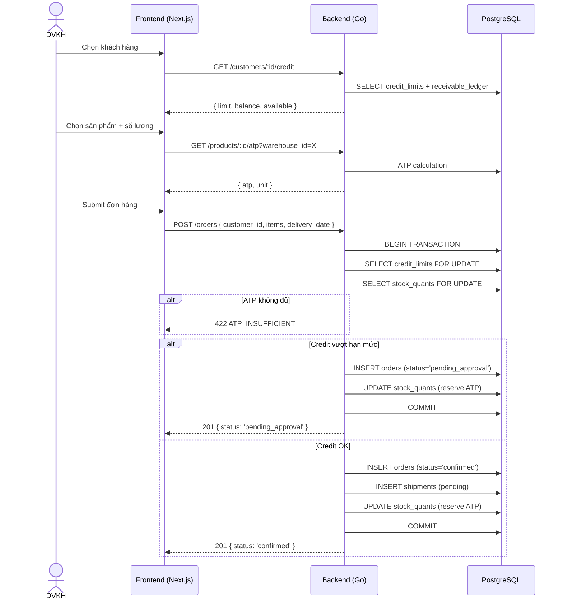
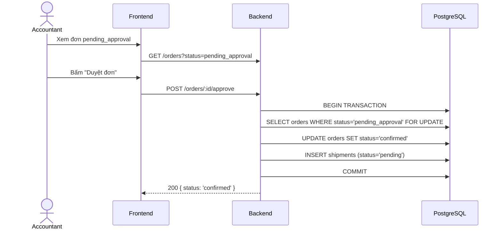
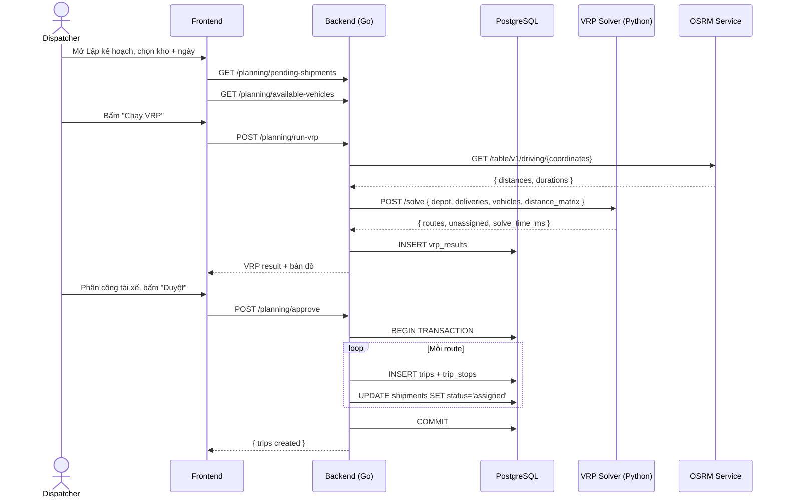
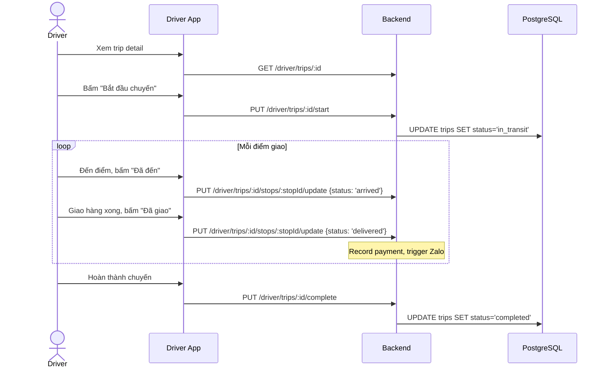
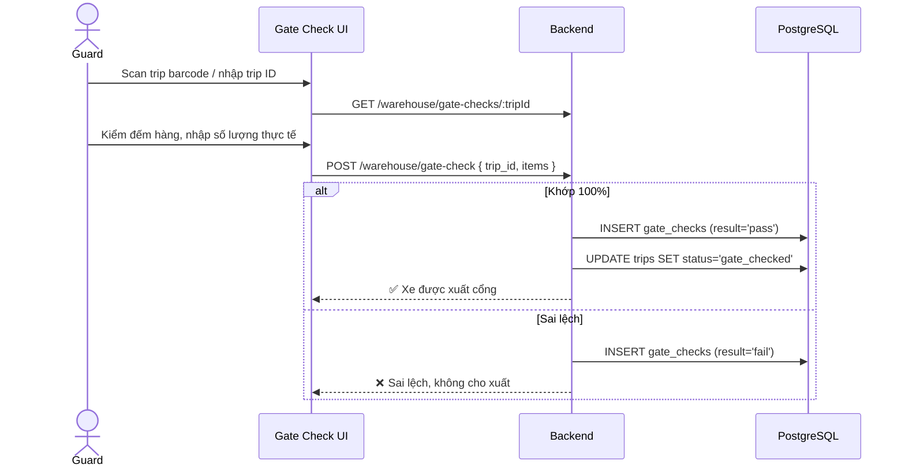
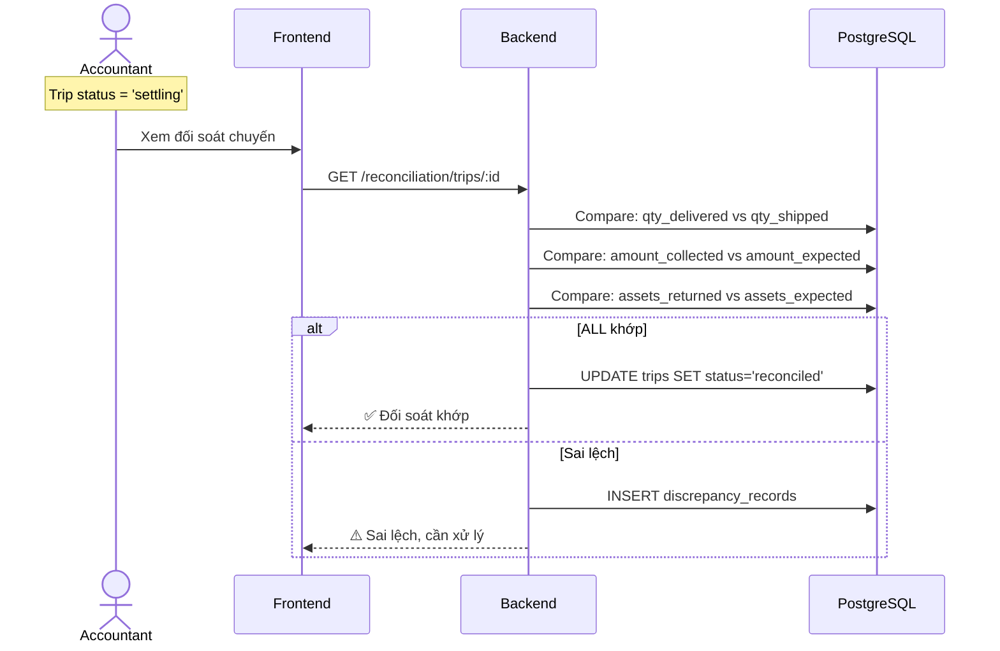

# SEQUENCE DIAGRAMS — BHL OMS-TMS-WMS

> **Mục đích:** Mô tả luồng tương tác end-to-end giữa các thành phần.
> AI dùng khi implement các flow phức tạp để hiểu đúng thứ tự gọi API, side effects.

---

## SD-01: TẠO ĐƠN HÀNG (Create Order with ATP + Credit Check)

---

## SD-02: DUYỆT ĐƠN VƯỢT HẠN MỨC (Accountant Approve)

---

## SD-03: VRP PLANNING → TRIP CREATION

---

## SD-04: DRIVER DELIVERY FLOW

---

## SD-05: GATE CHECK FLOW

---

## SD-06: RECONCILIATION FLOW

---

*SEQUENCE DIAGRAMS v1.0 — 15/03/2026*
